# web-app-tutorial-laravel-template

## 概要
記事、記事へのコメントのCRUD処理（パスワード認証が必要な機能あり）

## 使用言語、ライブラリ


## 環境構築
```
$ cd web-app-tutorial-laravel
$ make build
$ make app

# コンテナ内での作業
$ php artisan serve --host 0.0.0.0 --port 8000 #サーバ起動
$ php artisan key:generate
$ chmod -R 775 storage bootstrap/cache
$ php artisan migrate
$ php artisan db:seed 
```

## APIアクセス（Swagger UI）
http://localhost:8000/api/documentation でL5 Swagger UI画面にアクセス  
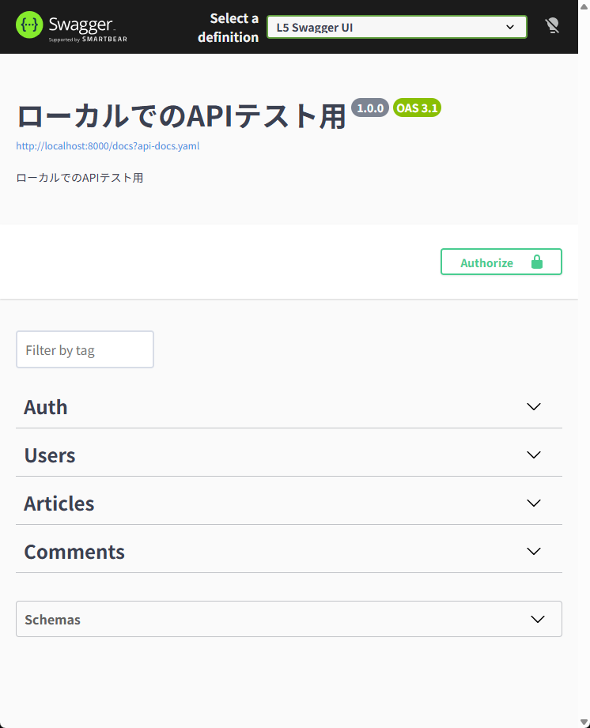  
  
### テスト用アカウント  
email: taro@example.com  
password: password  
<br>
記事、コメントの一覧や詳細の取得は未ログインでもアクセス可能だが、  
記事、コメントの作成、編集、削除にはログインが必要のため  
先にログインを済ませておく。

#### ログイン手順：
①Auth配下の **GET /sanctum/csrf-cookie** のタブを開く
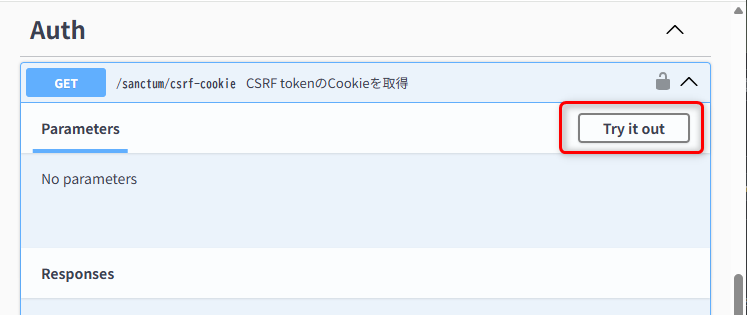  

②Excecuteを押下し　**GET /sanctum/csrf-cookie**　を実行する  
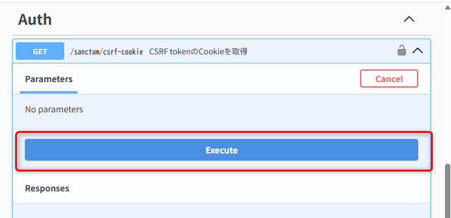 

③204レスポンスが返ることを確認する  
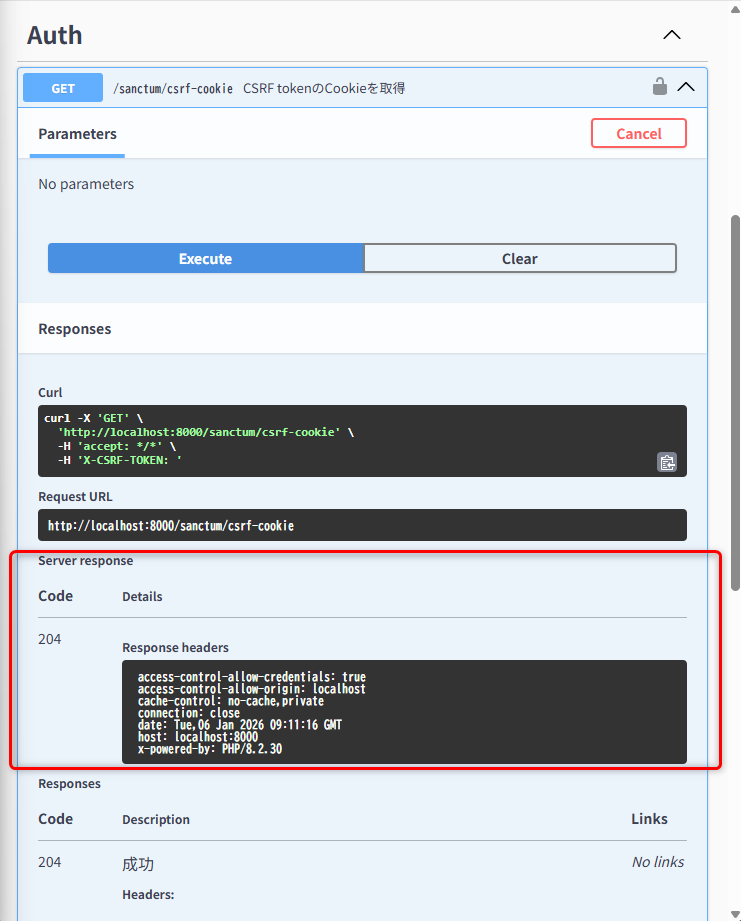 

④検証ツールのApplicationタブを開き、URL decodeされたXSRF-TOKENを取得する  
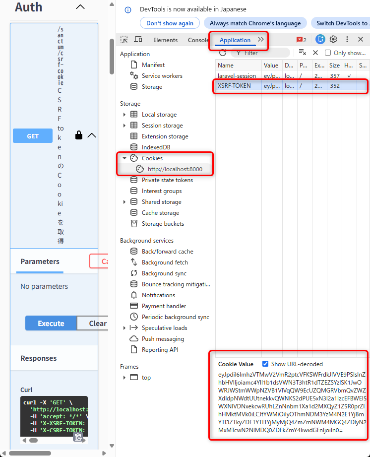  

⑤画面上部のAuthorizeボタンを押下する  
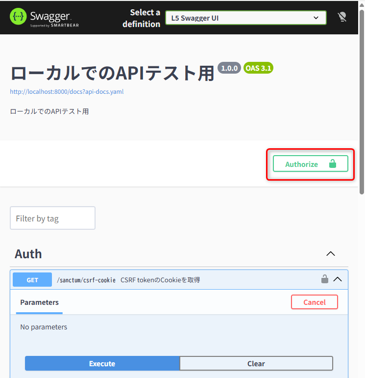  

⑥ ④で取得したXSRF-TOKENを設定して閉じる  
  

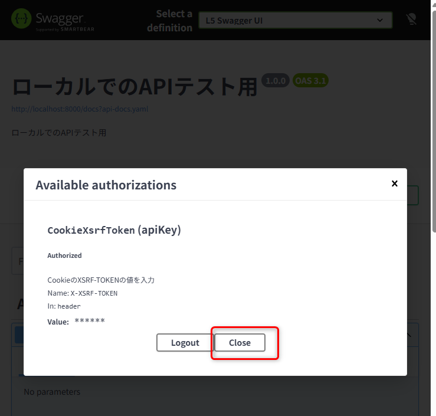  

⑦Auth配下の **POST /login** を実行する
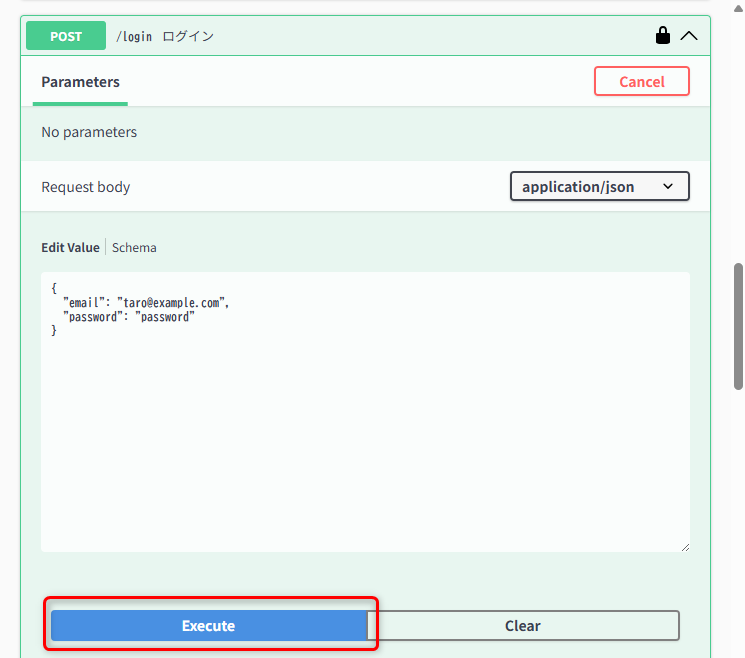  

⑧200レスポンスが返ることを確認する   
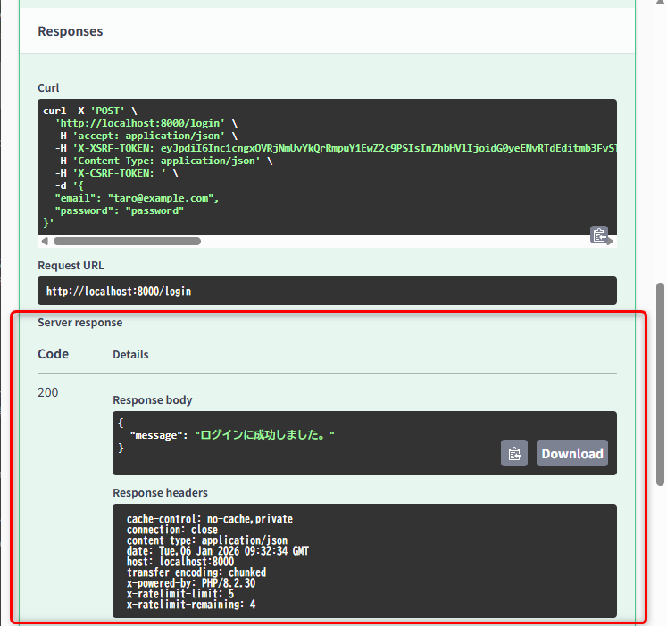  

⑨ ④~⑥と同様URL decodeされたXSRF-TOKENを取得し、Authorizeに設定する  
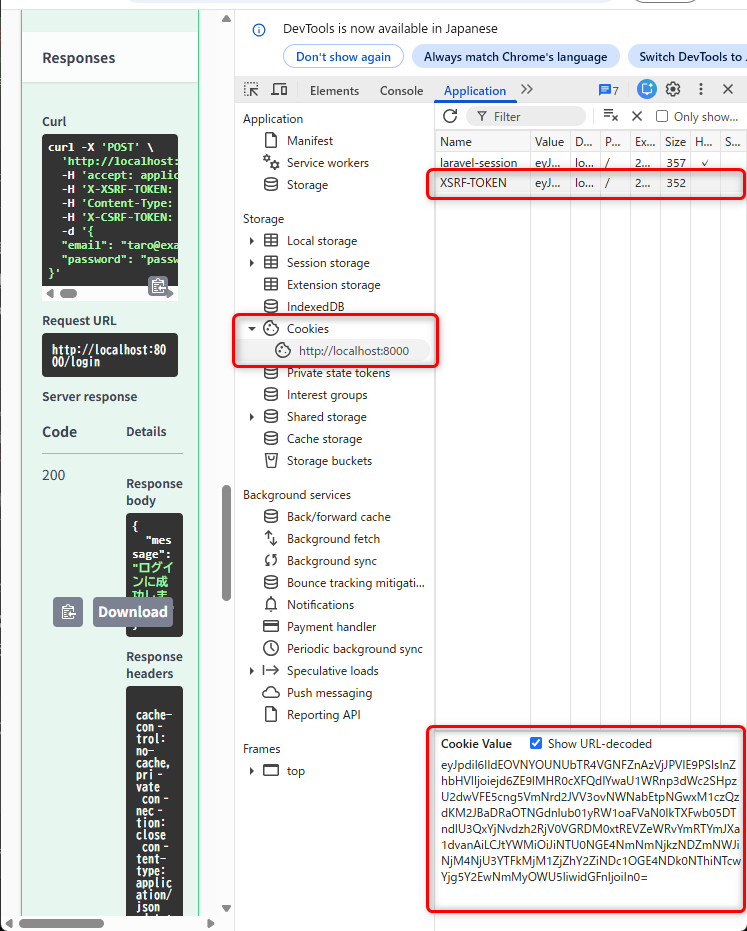  

⑩ログインが必要な **POST /articles**(記事作成) 等も実行可能 
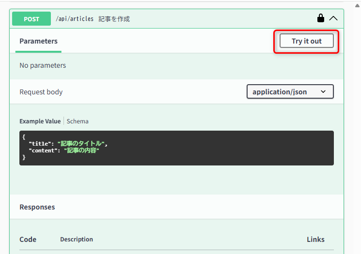 
